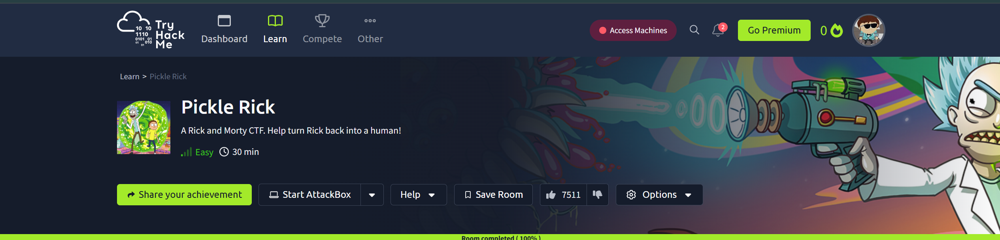

# 🧪 Pickle Rick | TryHackMe Walkthrough  

---

## 📜 **Resumen**  

Bienvenidos al caos más delirante del hacking virtual. Tu misión: ayudar a Rick, quien ha vuelto a convertirse en un pepinillo porque, según él, "¡es ciencia, Morty!" Pero ahora no recuerda cómo volver a ser humano. Tienes que infiltrarte en un servidor, encontrar **tres ingredientes secretos** y devolverlo a su forma humana antes de que decida bañarse en vinagre para siempre.  

Si aún no conoces el desafío, [haz clic aquí](https://tryhackme.com/room/picklerick) para comenzar.  

---

## 🛠️ **Pasos para resolver el reto**

### **Paso 1: Enumeración de la red**  
Lo primero que hacemos es escanear el objetivo para detectar puertos abiertos y servicios en ejecución. Para ello utilizamos `nmap`, una herramienta fundamental en cualquier actividad de reconocimiento.

| **Command**         | **Output**                         |
|---------------------|-------------------------------------|
| `nmap -sV 10.10.XX.XX` | Open Ports: - 22/tcp (SSH) - 80/tcp (HTTP) |
| **Scan Time**       | 1.32 seconds                      |
| **MAC Address**     | 08:XX:TY:XX:XX:XX                 |

El servidor tiene un puerto HTTP abierto en el 80. Vamos a investigarlo.

---

### **Paso 2: Inspección del código fuente**  
Al visitar la página web en `http://10.10.XX.XX`, encontramos un mensaje de Rick solicitando ayuda. Investigamos el código fuente del sitio y descubrimos un comentario oculto:

| **Source Code Snippet** |
|--------------------------|
| `<!-- Username: R1ckRul3s -->` |

Ya tenemos el nombre de usuario. El siguiente paso será obtener la contraseña.

---

### **Paso 3: Escaneo de vulnerabilidades con Nikto**  
Usamos **Nikto** para analizar el servidor en busca de configuraciones débiles, páginas expuestas o posibles fallos.

| **Command**          | **Output Highlights**                              |
|----------------------|---------------------------------------------------|
| `nikto -host 10.10.XX.XX` | - `/login.php`: Found login page - `/robots.txt`: Potential sensitive data |

Encontramos dos rutas interesantes: `/login.php` y `/robots.txt`. Revisemos primero el archivo `robots.txt`.

---

### **Paso 4: Explorando robots.txt**  
El archivo `robots.txt` contiene información que no debería ser accesible para los usuarios normales. Al analizarlo en `http://10.10.XX.XX/robots.txt`, encontramos el siguiente contenido:

| **robots.txt Content** |
|-------------------------|
| Wubbalubbadubdub        |

Esto parece ser la contraseña. Ahora tenemos las credenciales completas: `R1ckRul3s` como usuario y `Wubbalubbadubdub` como contraseña. Probémoslas en el panel de administración.

---

### **Paso 5: Acceso al panel de administración**  
Al visitar `/login.php`, ingresamos las credenciales y accedemos al sistema de administración remota. Desde este panel, podemos ejecutar comandos directamente en el servidor. ¡Es hora de buscar los ingredientes secretos!

| **Username**    | **Password**         |
|-----------------|----------------------|
| `R1ckRul3s`     | `Wubbalubbadubdub`   |

---

### **Paso 6: Recolección de ingredientes**

#### 🥒 **Ingrediente 1: mr. meeseek hair**  
Comenzamos explorando los archivos en el servidor utilizando comandos básicos como `ls` y `cat`. En el directorio raíz, encontramos un archivo con el primer ingrediente:

| **Command**            | **Output**                     |
|------------------------|---------------------------------|
| `cat Sup3rS3cretPickl3Ingred.txt` | `mr. meeseek hair`           |

---

#### 🥒 **Ingrediente 2: 1 jerry tear**  
Exploramos el directorio de usuario `/home/rick` y encontramos un archivo con el segundo ingrediente. Rick parece haber dejado todo organizado... a su manera.

| **Command**                | **Output**                  |
|----------------------------|-----------------------------|
| `ls -a /home/rick`         | `second_ingredient.txt`     |
| `cat /home/rick/second_ingredient.txt` | `1 jerry tear`            |

---

#### 🥒 **Ingrediente 3: fleeb juice**  
Finalmente, navegamos al directorio `/root`, donde encontramos el último archivo con el tercer ingrediente:

| **Command**            | **Output**                     |
|------------------------|---------------------------------|
| `cat /root/3rd.txt`    | `fleeb juice`                  |

---

## 🏁 **Conclusión**  
¡Misión cumplida! Ayudaste a Rick a recolectar los tres ingredientes necesarios para revertir su transformación en pepinillo. A continuación, un resumen de los ingredientes recolectados:

| **Ingrediente**      | **Ubicación**      |
|---------------------|-------------------|
| `mr. meeseek hair`  | `/var/www/html`  |
| `1 jerry tear`      | `/home/rick`     |
| `fleeb juice`       | `/root`          |

Rick ha vuelto a su forma humana, al menos por ahora. Este reto nos recuerda lo importante que es la **seguridad en servidores** y por qué no debes dejar contraseñas en archivos visibles. ¡Gracias por seguir este walkthrough y hasta el próximo desafío! 🚀

