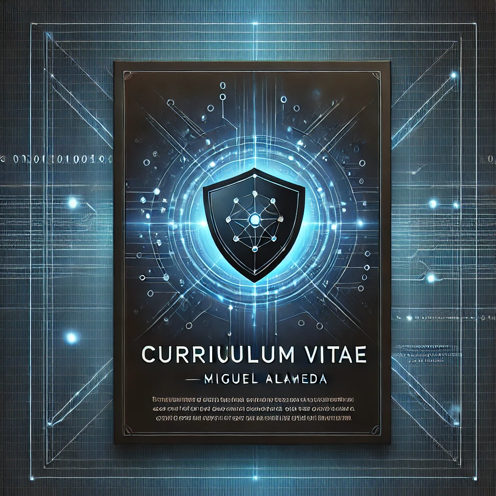

()

# **Miguel Alameda**  
**Analista de Ciberseguridad | SOC | Blue Team**  
📧 [jmiguel.htp@gmail.com](mailto:jmiguel.htp@gmail.com) | 🌐 [LinkedIn](https://www.linkedin.com/in/jmam84)

---

## **Certificaciones Clave**

| **Certificación**                                          | **Entidad**          | **Año** |
|-----------------------------------------------------------|----------------------|---------|
| **FortiGate 7.4 Operator**                                 | Fortinet             | 2024    |
| **MITRE ATT&CK Defender**                                  | LetsDefend           | 2024    |
| **Blue Team Level 1 (BTL1)**                               | Security Blue Team   | 2024    |
| **Understanding Threats and Attacks**                      | Splunk               | 2024    |
| **Digital Forensics Essentials**                           | EC-Council           | 2023    |
| **CyberOps Associate**                                     | Cisco                | 2023    |
| **Microsoft Certified: Azure Fundamentals (AZ-900)**       | Microsoft            | 2022    |
| **Microsoft Certified: Security, Compliance, and Identity Fundamentals (SC-900)** | Microsoft            | 2022    |
| **Fundamentals of Network Security**                       | Palo Alto Networks   | 2022    |
| **Networking Essentials**                                  | Cisco                | 2022    |

---

## **Experiencia Profesional**

### **Wise Security Global**  
**Analista de Ciberseguridad - Equipo de Detección y Respuesta (SOC) | Nivel 1**  
*Dic. 2022 – Presente | Madrid, España*  

| **Responsabilidad**                                         | **Herramientas y Métodos**                               |
|-------------------------------------------------------------|---------------------------------------------------------|
| Monitorización y análisis de eventos de seguridad en tiempo real | **Microsoft Sentinel**, **Google SOAR**                  |
| Respuesta y resolución de incidentes siguiendo procedimientos establecidos | **JIRA**, análisis de logs, gestión de tickets          |
| Identificación, bloqueo y reporte de IOCs maliciosos         | **Microsoft Defender**, políticas de bloqueos automáticos |
| Elaboración de informes sobre incidentes de seguridad       | Informes de incidentes, reportes semanales de actividad  |
| Colaboración en el seguimiento y cierre de incidentes       | **JIRA**, escalamiento de incidentes                     |

---

## **Formación y Cursos**

| **Curso**                                                  | **Institución**             | **Año** |
|------------------------------------------------------------|-----------------------------|---------|
| **Experto en Ciberseguridad (300 horas)**                  | Fundación GoodJob / Impartido por Román Ramírez, Cofundador de RootedCON | 2022    |
| **Big Data y Análisis de Datos**                           | Inserta Empleo / Fundación ONCE | 2022  |

---

