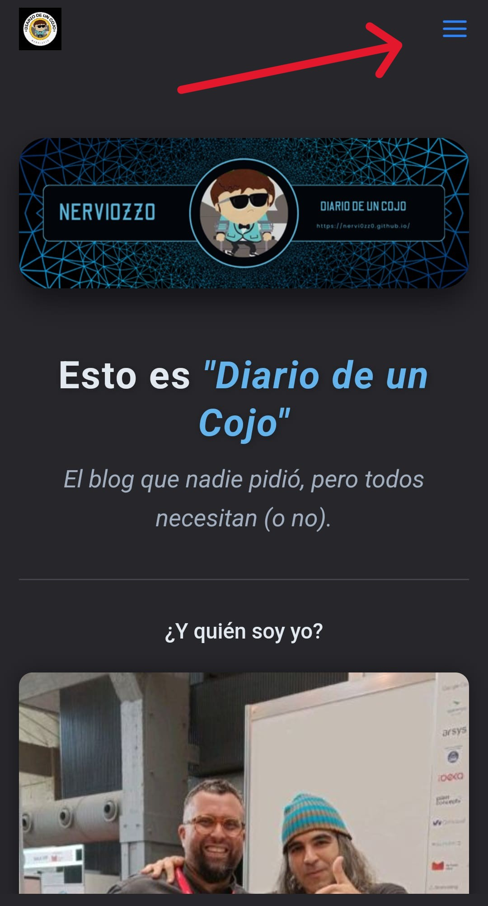

  

<h1 style="font-size: 36px; font-weight: 700; color: #E2E8F0; text-shadow: 1px 1px 6px rgba(0,0,0,0.3); margin: 0; font-family: 'Arial', sans-serif; letter-spacing: 1px;">
  Esto es "Diario de un Cojo"
</h1>

  El blog que nadie pidió, pero todos necesitan (o no).

---

<h2 align="center" style="color: #E2E8F0;">&iquest;Y quién soy yo?</h2>

  
  
Soy el que no lleva gorro... Obvio.

---

<h2 align="center" style="color: #E2E8F0;">Un poco sobre mí, o cómo la vida me empujó a hacer esto…</h2>

{: .note }
> **Nota Personal:** Este blog nació del tiempo libre (y del dolor) que una lesión me regaló. Reflexiones, humor y un toque de ciberseguridad, todo en un solo lugar.

Mi nombre es <strong>Miguel</strong>, también conocido como <strong>nervi0zz0</strong> (ni en mi casa me conocen así). En este momento, estoy mucho más cojo de lo habitual, debido a una lesión reciente en la pierna que me ha dejado con un dolor insoportable y una receta interminable de opiáceos. La medicina manda ahora, porque, siendo sincero, lo único que a veces alivia el sufrimiento físico es andar por la vida como un zombi.

{: .tip }
> **Pro-tip:** Nunca subestimes el poder de los opiáceos para convertirte en un filósofo amateur.

Pero claro, no todo en la vida es dolor y drogas... al menos no de forma literal! Este parón forzoso me dio tiempo para pensar. Y como no podía pasar el día mirando el techo sin hacer nada, decidí hacer algo útil: escribir un blog. ¿Por qué no? Si ya estoy de baja, con tiempo para reflexionar sobre mi vida, mis fracasos y cómo seguir aprendiendo algo, ¿por qué no compartir esas inquietudes? Total, si nadie lo lee, al menos me habré desahogado. Esto me sale gratis!

Ahora paso los días entre sesiones de cama, sofá y reposo forzoso, haciendo cosas que nunca había tenido tiempo de hacer antes. Sí, como resolver <strong>CTFs</strong>, y seguir aprendiendo sobre <strong>capturar banderitas</strong>. Si no estás al día, ya sabes... "camarón que se duerme, se lo lleva la corriente".

{: .quote }
> "Esta pierna jodida me da tiempo para pensar y compartir mis reflexiones sobre lo absurdo de la vida. Y si puedo mezclar un poco de mala hostia con ciberseguridad en el camino, ¿por qué no?"

<strong>Bienvenidos a mi espacio: Diario de un Cojo.</strong>

---

<h2 style="color: #E2E8F0;">&iquest;Qué puedes esperar aquí?</h2>

| 🧠 **Mis pensamientos** | Reflexiones filosóficas y pensamientos existenciales alimentados por los opiáceos. |
|----------------------------------|-----------------------------------------------------------------------------|
| 💻 **Ciberseguridad**     | Relatos del día a día en un mundo lleno de amenazas y "usuarios expertos".       |
| 📖 **Recursos**           | Rutas de aprendizaje y recursos que recopilo mientras descanso.               |

---

<h3 style="color: #E2E8F0;">Disfruta de esta estancia</h3>

{: .success }
> Si decides quedarte, <strong>¡bienvenido!</strong> Y si no, al menos me habré reído un poco. ¡Gracias, pierna, por darme tanto tiempo para hacer cosas tan útiles!

---

<h3 style="color: #E2E8F0;">Antes de continuar debes saber que</h3>

{: .important }
> Ten en cuenta que no me responsabilizo de lo escrito aquí. ¿Los opiáceos cuentan como atenuante?

{: .warning }
> ⚠️ **Atención:** Algunos de los temas tratados en este blog son solo para audiencias experimentadas en el mundo de la ciberseguridad. No intentes esto en casa sin supervisión... Que no, tonto, si lo escribo yo, que no tengo mucha idea.

---

  

    Si estás viendo este blog desde un teléfono móvil o celular, recuerda que para ver el contenido completo debes abrir el menú situado en la parte superior derecha, representado por tres líneas horizontales. No seas zoquete.
  

  

---

{: .success }
> Si decides quedarte, <strong>¡bienvenido!</strong> Y si no, al menos me habré reído un poco. ¡Gracias, pierna, por darme tanto tiempo para hacer cosas tan útiles!

  

  

  
&copy; 2024 Nervi0zz0

