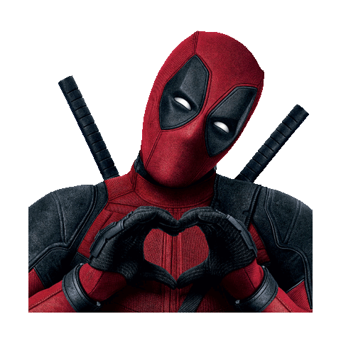

# 👾 Hola, soy Miguel (alias Nervi0zz0), que suena más épico

---

## ¿Quién soy?

Soy esa persona que vive rodeada de alertas y logs en un CSOC (Centro de Operaciones de Seguridad). Básicamente, paso mi tiempo:  
- Detectando amenazas mientras finjo entender todos los logs (spoiler: no siempre los entiendo).  
- Peleando con los usuarios, que el 99% de las veces no saben qué hacen, y cuando finalmente saben algo, responden con un: *"He sido yo"*.  
- Decidiendo si esta alerta es TP (True Positive) o FP (False Positive), mientras sobrevivo a base de macarrones recalentados, café frío y un toque de caos. 🔥  

Cuando no estoy en eso, me divierto resolviendo CTFs (desafíos de hacking ético) como si no hubiera mañana, explorando plataformas como TryHackMe, LetsDefend y Blue Team Labs.  

---

## ¿Por qué estoy haciendo esto?

Buena pregunta. Quizá porque tengo una pierna jodida y ahora me sobra el tiempo. Ya sabes, ser un cojo tiene sus ventajas: de repente pasas de correr por la vida a tener todo el tiempo del mundo para reflexionar sobre el sentido de la existencia. O para hacer cosas como esta, que es básicamente lo mismo.

Porque cuando la vida te da limones… bueno, a veces te los lanza tan fuerte que terminas en el sofá buscando maneras creativas de no volverte loco. Esto es una de esas maneras.

Bienvenidos a *Diario de un Cojo*.

---

## ¿Qué encontrarás aquí?

¿Esperabas algo inspirador o motivador? Pues siento decepcionarte.  
Este es un rincón donde comparto:  
- Mis pensamientos, aunque nadie los haya pedido.  
- Lo que hago en mi trabajo (porque alguien tiene que contarlo).  
- Rutas de estudio que te harán parecer productivo, aunque no lo seas.  
- Noticias irrelevantes sobre mí que no pediste saber, pero igual te las cuento.  

---

Disfruta tu estancia, y si no… al menos ya perdí más tiempo escribiendo esto que tú leyéndolo.  

Ah, y por si te preguntas más sobre mí, esto no es Tinder ni Grindr. Aquí no se discrimina a nadie.  

Pero si decides quedarte, bienvenido. 😎  

