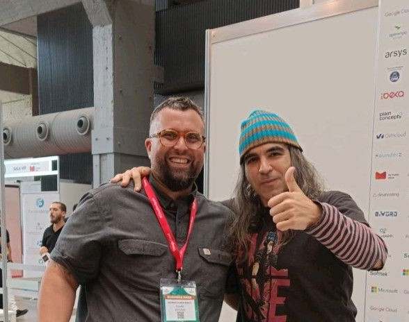

👾 **Hola**, soy Miguel, pero puedes llamarme Nervi0zz0, que suena mucho más épico.  
Me especializo en:

- Detectar amenazas mientras finjo que entiendo todos los logs (spoiler: no siempre los entiendo).  
- Hablar con usuarios que, la mayoría de las veces, no tienen ni idea de lo que digo. Y cuando finalmente entienden algo, responden con un: *“He sido yo”*.  
- Pasar mi día decidiendo si esta alerta es **TP** o **FP**, mientras me alimento de macarrones del día anterior, café frío y un poco de caos. 🔥  

Trabajo en un **CSOC**, lo que básicamente significa que vivo rodeado de alertas y logs, y mi vida está en manos de cómo interpreto esas señales de humo digitales.

Cuando me aburro, me encontrarás resolviendo **CTFs** como si no hubiera un mañana. O explorando plataformas como **TryHackMe**, **LetsDefend** y **Blue Team Labs**.

---

# Bienvenidos a este rincón del Internet que llamaré **"Mi Blog"**

¿Esperabas algo inspirador o motivador? **Pues siento decepcionarte.**  
Este es el lugar donde tiro mis pensamientos semi-filosóficos, hablo de mi trabajo (porque alguien tiene que hacerlo), y te doy algunas rutas de estudio para que parezcas productivo sin realmente hacerlo. Ah, y también soltaré alguna que otra noticia irrelevante sobre mí que probablemente no necesites saber.

---

## ¿Qué puedes esperar aquí?

- **Artículos Reflexivos:** Esenciales para soltar todo lo que se me pase por la cabeza sin filtro.  
- **Rutas de Estudio:** Mapas para aprender algo nuevo, porque si no haces nada, al menos que parezca que estás intentando.  
- **Noticias Sobre Mí:** Porque a veces es necesario hablar de uno mismo, aunque no te interese.  
- **Lo que surja:** Porque este es mi blog, no tu enciclopedia personal. 🎉

---

## ¿Por qué estoy haciendo esto?

Buena pregunta. A lo mejor porque tengo una pierna jodida y ahora me sobra el tiempo. Ya sabes, ser un cojo tiene esas ventajas: de repente pasas de correr por la vida a tener todo el tiempo del mundo para reflexionar sobre el sentido de la existencia. O hacer cosas como esta, que es lo mismo.

Porque, cuando la vida te da limones… bueno, a veces te los lanza tan fuerte que terminas en el sofá buscando maneras creativas de no volverte loco. Esto es una de esas maneras.

---

### Disfruta de tu estancia, comparte si te hace gracia, y si no… al menos perdiste unos minutos de tu vida leyendo esto.

---

¿Quieres saber más? Pues... lo siento, no es Tinder.  
Pero si decides quedarte, ¡te invito a unirte al lado azul de la fuerza! 😎

